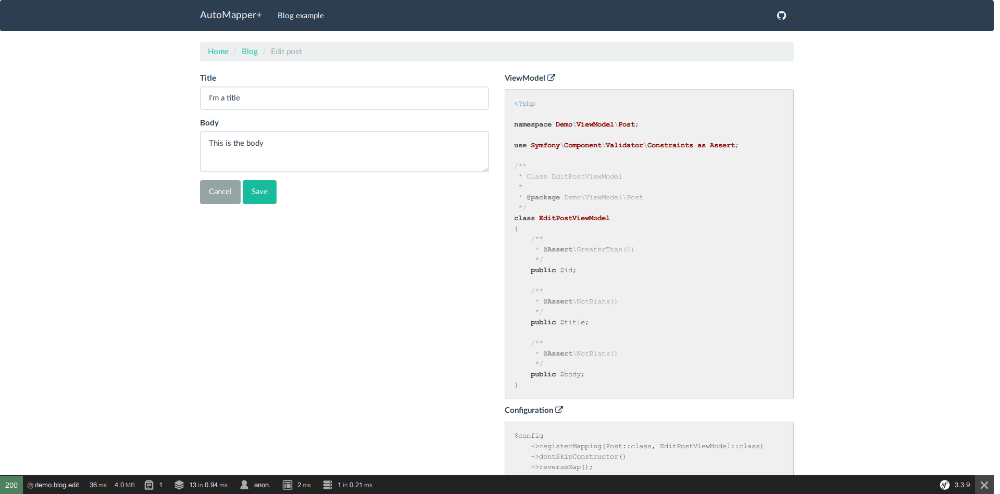

# AutoMapperPlus Demo App

A basic Symfony app demonstrating the usage of [AutoMapper+](https://www.github.com/mark-gerarts/automapper-plus)
and its [bundle](https://github.com/mark-gerarts/automapper-plus-bundle).

## Points of interest
This app should give you some insight on how to use the AutoMapper+ bundle. 
Following things are of interest:

- **[The config file](https://github.com/mark-gerarts/automapper-plus-demo-app/blob/master/src/Demo/AutoMapperConfig.php)**:<br>
This is where the mappings are being registered. Because the demo app is super 
small, all the config resides in a single file. Should the complexity of your
app grow, it might be desired to split the config.
- **[The config service definition](https://github.com/mark-gerarts/automapper-plus-demo-app/blob/master/app/config/services/services.yml)**:<br>
For a configurator to be recognized, it has to be tagged with 
`automapper_plus.configurator`.
- **[The ViewModel directory](https://github.com/mark-gerarts/automapper-plus-demo-app/tree/master/src/Demo/ViewModel/Post)**:<br>
This is where the viewmodels for the Post entity are defined.
- **[The form types](https://github.com/mark-gerarts/automapper-plus-demo-app/tree/master/src/Demo/Form)**:<br>
These are attached to the viewmodels instead of the entity.

**Note**: you'll notice that this demo doesn't follow the Symfony standards by
 using a no-bundle approach. The architecture follows the core concepts
 explained in [this post by Elnur Abdurrakhimov](http://elnur.pro/symfony-without-bundles/).

## Running the app
The main goal of this project is to provide you some code to browse through. 
Should you want to run the application yourself, you'll need to perform 
following steps:

```bash
$ git clone https://github.com/mark-gerarts/automapper-plus-bundle.git
$ cd automapper-plus-bundle
$ mkdir var/data
$ composer install
$ bin/console doctrine:schema:force
$ bin/console server:start
```

You'll need the following as well:
- PHP7.1+
- sqlite3 driver

With everything setup, you can navigate to [localhost/blog](http://localhost:8000/blog)
to see the running app.


